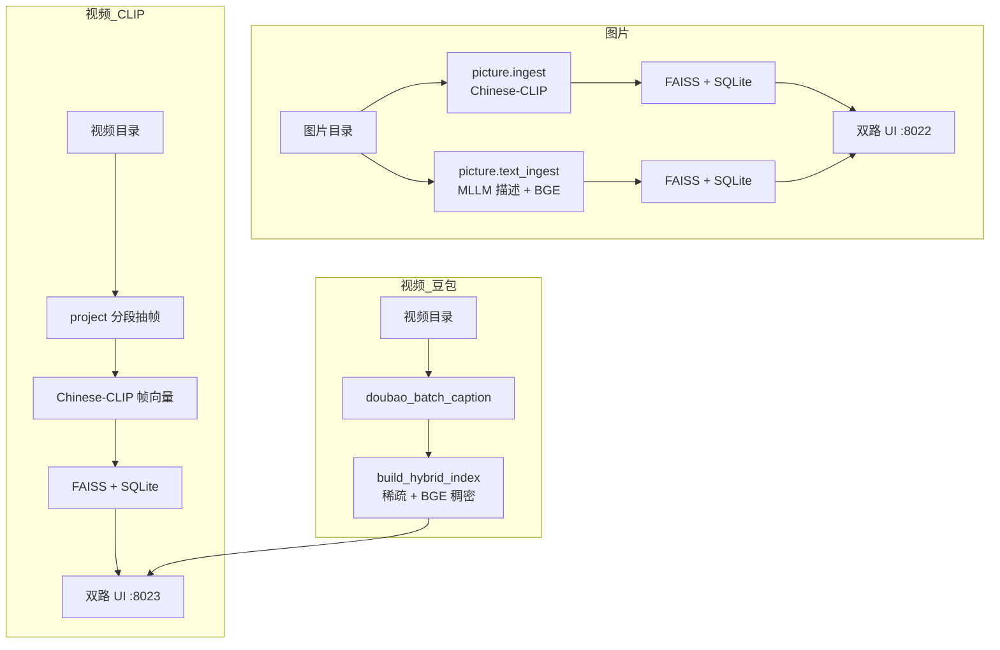

# chinese-clip

中文多模态检索工具集：面向**文搜图**与**文搜视频**场景，提供多套可对比的入库与检索方案。同一批素材可同时走「视觉向量（Chinese-CLIP）」与「文本描述向量（豆包/MLLM + BGE）」两条路线，并通过 Web UI 并排查看检索效果。

本仓库侧重**工程化管线**（分段、抽帧、建索引、检索），而非模型训练。模型权重、原始数据、FAISS 索引等需在本机自行准备（见 [本地资源与 Git](#本地资源与-git)）。

---

## 核心能力

| 模态 | 方案 A（视觉语义） | 方案 B（文本语义） |
|------|-------------------|-------------------|
| **视频** | `video_retrieval/clip/`：Chinese-CLIP 帧向量检索 | `video_retrieval/hybrid/`：豆包字幕 + 稀疏/稠密混合检索 |
| **图片** | `picture/`：Chinese-CLIP 图像向量直接入库 | `picture/`：MLLM 结构化描述 → BGE 文本向量入库 |

**对比服务**

- 图片双路：`picture/dual_search_service.py`，默认端口 **8022**
- **视频统一检索**：`video_retrieval.api`（CLIP + 混合检索），默认端口 **8023**

---

## 架构概览



---

## 目录结构

```
chinese_clip/
├── video_retrieval/         # ★ 视频检索：源码 + 模型 + 索引 + API
│   ├── clip/                # Chinese-CLIP 视觉检索
│   ├── hybrid/              # 豆包混合检索
│   ├── models/              # Chinese-CLIP 权重（需自备）
│   ├── profiles/<name>/     # 推荐：clip/ + hybrid/ 统一 profile
│   ├── legacy/              # 旧 clip_profiles / hybrid_profiles
│   └── videos/              # 本地视频（可选，也可用 data/videos）
├── picture/                 # 图片 CLIP / MLLM+BGE 双方案
├── chinese_clip/app/        # 独立 Embedding API（部署用）
├── data/                    # 数据集，如 MUGE（已 gitignore）
├── docs/MIGRATION.md        # 原 project/、doubao_pipeline/ 迁移说明
├── docs/CODE_STYLE.md       # Ruff 格式化与风格约定
└── docs/GITHUB_UPLOAD.md    # 推送 GitHub 说明
```

---

## 模块说明

### 0. `video_retrieval/` — 统一视频检索（推荐）

**视频检索的全部实现与本地数据均在本包**（`clip/` + `hybrid/` + `models/` + `profiles/` + `legacy/`）。原 `project/`、`doubao_pipeline/` 已删除，见 [`docs/MIGRATION.md`](docs/MIGRATION.md)。

统一 API、建库入口，并支持 profile 目录：

```
video_retrieval/profiles/<profile>/
  clip/output/ + metadata.db
  hybrid/captions.jsonl + hybrid_index/ + metadata.db
```

未建统一目录时自动回退 `video_retrieval/legacy/clip_profiles/` 与 `legacy/hybrid_profiles/`。

**建库**

```bash
python -m video_retrieval.pipeline --profile my_media --video-dir data/videos --steps both --init-unified
```

`--steps`：`clip` | `hybrid` | `both`

**检索 API**

```bash
python -m video_retrieval.api --profile my_media --port 8023
```

`POST /search`：`{"query": "...", "mode": "clip|hybrid|both", "top_k": 10}`

详见 [`video_retrieval/README.md`](video_retrieval/README.md) 与 [`docs/MIGRATION.md`](docs/MIGRATION.md)。

---

### 1. `video_retrieval/clip/` — Chinese-CLIP 视频检索

基于 **Chinese-CLIP** 对视频做视觉语义检索。

**处理流程**

1. 将源视频按固定时长切分为 segment  
2. 在每个 segment 内按 FPS 采样候选帧  
3. 用 Chinese-CLIP 编码候选帧，段内做多样性筛选保留 top-k 帧  
4. 帧向量池化为 segment 向量，再选出视频的代表性 segment  
5. 元数据写入 SQLite，向量写入 FAISS  
6. 检索时：视频级召回 → 段级召回 → 帧重排 → 时间轴合并（`retrieval.py`）

**常用命令**

```bash
# 环境检查
python -m video_retrieval.clip.validate_env --model-path video_retrieval/models

# 建库（示例 profile：seg4s）
python -m video_retrieval.clip.minimal_pipeline \
  --profile seg4s \
  --video-dir data/videos \
  --model-path video_retrieval/models \
  --device cuda

# 单独启动检索 API
python -m video_retrieval.api \
  --profile seg4s \
  --model-path video_retrieval/models \
  --device cuda

# 重建 FAISS（不重抽帧）
python -m video_retrieval.clip.rebuild_indexes --profile seg4s ...
```

**依赖**：`torch`、`transformers`、`opencv-python`、`faiss-cpu`、`fastapi`、`uvicorn`，以及系统已安装的 **ffmpeg**。

模块说明见 [`video_retrieval/clip/README.md`](video_retrieval/clip/README.md)。

---

### 2. `video_retrieval/hybrid/` — 豆包字幕 + 混合视频检索

适合「先有可读描述，再用自然语言搜视频」的路线（`video_retrieval/hybrid/`）。

**典型流程**

```bash
# 推荐：统一建库
python -m video_retrieval.pipeline --profile apr_media1 --steps hybrid --video-dir data/videos

# 或分步
python -m video_retrieval.hybrid.doubao_batch_caption --profile apr_media1 --video-dir data/videos
python -m video_retrieval.hybrid.build_hybrid_index --profile apr_media1
```

**主要脚本**

| 文件 | 作用 |
|------|------|
| `doubao_batch_caption.py` | 分段抽帧，调用豆包 API 写 caption |
| `build_hybrid_index.py` | 稀疏词项 + BGE 稠密向量，写入 profile 目录 |
| `hybrid_retrieval.py` | 混合检索引擎（RRF） |

未传 `--profile` 时默认 Hybrid profile：`legacy/hybrid_profiles/apr_media1/`（`doubao_video_captions.jsonl`、`metadata.db`、`hybrid_index/`）。

---

### 3. `picture/` — 图片双方案检索

面向 MUGE 等图片集，支持两套并行索引：

| 路线 | 入库命令 | 索引内容 |
|------|----------|----------|
| **CLIP** | `python -m picture.ingest` | 图像 Chinese-CLIP 向量 |
| **BGE** | `python -m picture.text_ingest` | MLLM 结构化 caption → BGE 文本向量 |

**BGE 路线两阶段**（`text_ingest.py`）

1. **MLLM**：调用视觉大模型（默认火山方舟）生成 subject / color / action / style 等结构化字段  
2. **BGE**：将描述文本编码为向量并同步 FAISS

也可使用已有 caption 文件（如 `data/muge/dataset_1k_add/captions.txt`）配合数据集构建脚本，跳过在线 MLLM。

**常用命令**

```bash
# CLIP 入库
python -m picture.ingest --profile <profile> --image-dir <dir> \
  --model-path video_retrieval/models --device cuda

# BGE 入库（含 MLLM，需 API Key）
python -m picture.text_ingest --profile <profile> --image-dir <dir> --bge-device cuda
```

Profile 数据默认落在 `picture/profiles/<profile>/`（`output/`、`metadata.db`、`caption_metadata.db`、FAISS 文件）。

---

### 4. `chinese_clip/app/` — Embedding 服务（可选）

独立的 FastAPI 服务，对外提供 Chinese-CLIP 的图像/文本/视频帧 **embedding** 接口；长文本可配置 LLM 做摘要。适用于容器化部署，与上述 `project` / `picture` 本地管线相互独立。

```bash
# 环境可参考 chinese_clip/environment.yml（conda）
CHINESE_CLIP_MODEL_PATH=video_retrieval/models uvicorn chinese_clip.app.api_server_embedding:app
```

---

## 环境准备

### Python 虚拟环境

```bash
cd /path/to/chinese_clip
python -m venv .venv
source .venv/bin/activate
```

安装依赖（仓库根目录若无 `requirements.txt`，可参考 `chinese_clip/environment.yml` 或按模块安装）：

```bash
pip install torch transformers pillow opencv-python faiss-cpu fastapi uvicorn numpy pydantic openai python-dotenv tqdm
# 视频管线额外需要系统 ffmpeg
# BGE 路线需要：sentence-transformers 或项目内 dense_embeddings 所用后端
```

### 环境变量（`.env`）

在项目根目录创建 `.env`（**勿提交 Git**），常用项：

| 变量 | 用途 |
|------|------|
| `ARK_API_KEY` | 火山方舟 API Key（豆包视频 caption、picture MLLM 回退） |
| `DOUBAO_MODEL` | 豆包模型名（兼容 `DOUBAO_ENDPOINT_ID`） |
| `PICTURE_MLLM_API_KEY` / `PICTURE_MLLM_MODEL` | 图片 MLLM 专用（未设则回退 `ARK_API_KEY`） |
| `PICTURE_BGE_MODEL` | BGE 模型，默认 `BAAI/bge-large-zh-v1.5` |
| `CHINESE_CLIP_MODEL_PATH` | Embedding API 模型路径 |
| `LLM_API_KEY` | Embedding API 长文本摘要（可选） |

### 本地资源

| 路径 | 说明 |
|------|------|
| `video_retrieval/models/` | Chinese-CLIP 预训练权重 |
| `data/` | 如 `data/muge/train_extracted`、`dataset_1k`、`dataset_1k_add` |
| `*/profiles/<name>/` | 各模块建库后的 SQLite + FAISS + 中间文件 |
| `data/videos/` 或业务视频目录 | 视频源文件 |

---

## 数据准备（MUGE 示例）

MUGE 相关数据默认在 `data/muge/`（未纳入 Git），例如 `train_extracted/`、已整理好的 `dataset_1k/`、`dataset_1k_add/`（含 `images/` 与 caption 文件）。按目录直接 `picture.ingest` / `picture.text_ingest` 即可。

---

## 启动双路对比服务

### 图片（端口 8022）

先确保对应 profile 已完成 CLIP 与 BGE 入库，再启动：

```bash
python -m picture.dual_search_service \
  --clip-profile muge_train_clip \
  --bge-profile muge_1k_bge \
  --image-dir data/muge/train_extracted \
  --model-path video_retrieval/models \
  --device cuda --bge-device cuda \
  --host 0.0.0.0 --port 8022
```

服务会自动尝试 `train_extracted`、`dataset_1k/images`、`dataset_1k_add/images` 等路径解析媒体文件。

- 检索：`POST /search`，body `{"query": "红色连衣裙", "top_k": 10}`  
- 健康检查：`GET /health`  
- 缩略图：`GET /media/clip/{image_id}`、`GET /media/bge/{image_id}`  

### 视频（端口 8023）

```bash
python -m video_retrieval.api \
  --clip-profile apr_media1_project \
  --hybrid-profile apr_media1 \
  --model-path video_retrieval/models \
  --clip-device cuda --hybrid-device cuda \
  --host 0.0.0.0 --port 8023
```

---

## Profile 机制

各模块通过 `--profile <名称>` 将输出隔离到独立目录，便于同一套代码维护多份索引（例如 `muge_1k_clip` / `muge_1k_bge`、媒资库 `apr_media1` 等）。

| 模块 | Profile 根目录 |
|------|----------------|
| **`video_retrieval`** | `profiles/<name>/`（统一）或 `legacy/clip_profiles|hybrid_profiles/<name>/` |
| `picture` | `picture/profiles/<name>/` |

未指定 profile 时：CLIP 默认 `apr_media1_project`，Hybrid 默认 `apr_media1`（均在 `legacy/` 下）。

---

## 本地资源与 Git

以下内容**不会**随仓库推送（见 `.gitignore`）：

- `.env`、`.venv/`  
- `data/`、`video_retrieval/models/`、`video_retrieval/videos/`  
- `video_retrieval/profiles/`、`legacy/` 下的索引与 `metadata.db`  
- `*.faiss`、`*.npy` 等大文件  

从本机克隆后需自行放置模型与数据并重新建库。推送到 GitHub 的步骤见 [`docs/GITHUB_UPLOAD.md`](docs/GITHUB_UPLOAD.md)。

---

## 方案选型建议

| 场景 | 推荐 |
|------|------|
| 查询与画面内容强相关（物体、场景、颜色） | Chinese-CLIP 视觉路线（`project` / `picture.ingest`） |
| 查询偏抽象、叙事、标签化描述 | 豆包 caption + BGE / 混合检索（`video_retrieval/hybrid` / `picture.text_ingest`） |
| 对比两种思路的效果 | `picture.dual_search_service` :8022 / `video_retrieval.api` :8023 |
| 对外提供统一 embedding | `chinese_clip/app/api_server_embedding.py` |

---

## 许可证与数据

- 业务代码以本仓库为准；Chinese-CLIP、BGE、豆包等模型与 API 须遵守各自许可与服务条款。  
- `data/muge/` 等外部数据集请按数据源（如 ModelScope MUGE）要求使用。
